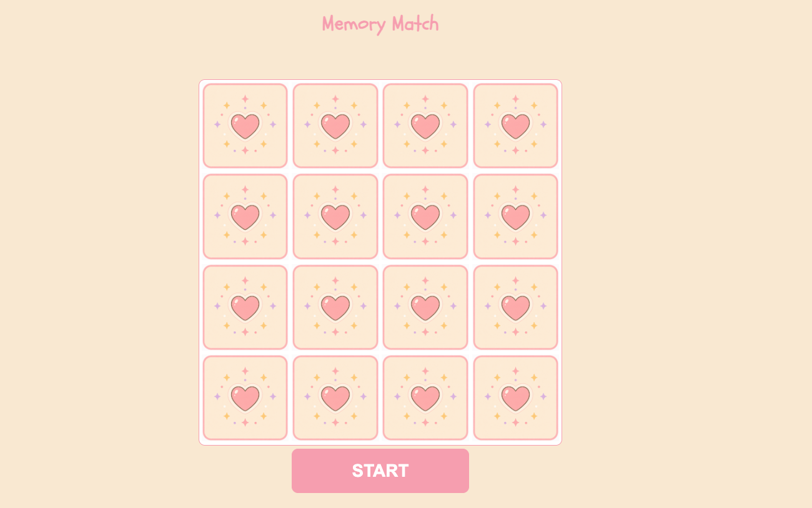

# Kawaii Memory Match Game

_A super cute memory matching card game._



## Getting Started

### Play the Game

[Deployed game](link-goes-here-later)

### How to Play
1. Press the start button
2. Click a card
3. Click a second card
4. Memorize the matching cards

### Installation
No installation required! Simply clone the repo to your machine and open the `index.html` file in your browser.

```
git clone
cd memory
open index.html
```

### Technologies Used
- **HTML**
- **CSS**
- JavaScript

### Future Enhancenments

### Credits
